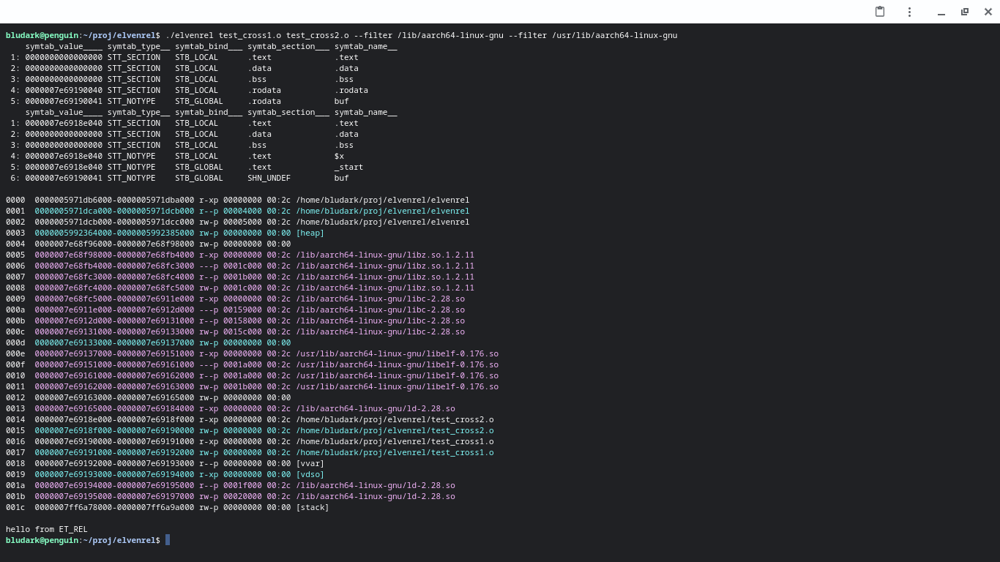

## elvenrel

Elven Relativism -- relocation and execution of aarch64 ELF relocatable objects (REL) on Linux and macOS.

Program loads a multitude of ELF REL files, resolves all relocations (currently only SHT_RELA) and if symbol `_start` in some section `.text` is found, passes control to the former.

## Details

* RELs loaded in the order specified on the command line; all relocations in a given REL performed at its loading time.
* Missing-symbol (SHN_UNDEF) resolution via reverse-direction search among the preceding RELs; first-match deterministic.
* Support for RO sections `.rodata` and `.text`; every other type of section is RW.
* Address-space sanitation (linux-only) -- disposing of pre-existing VMAs (*VMA filtering*) via string matching to VMA backing path.

## ToDo

* Relocation type SHT_REL; as needed.
* Explicit (CLI) control over the mapping addresses of each REL; as needed.

## Acknowledgements

Files used, with or without modifications, from external repositories:

	linux.org/ arch/arm64/include/asm/insn.h -> insn.h
	linux.org/ arch/arm64/kernel/module.c    -> reloc_add_aarch64.c
	linux.org/ arch/arm64/lib/strlen.S       -> strlen_linux.s

## Building: linux

	$ make all

## Building: macos

	$ make -f Makefile.macos all

## Usage

```sh
$ ./elvenrel test_cross_0.o test_cross_1.o # order of RELs matters for symbol resolution; undefined symbols in later RELs are sought in earlier RELs

$ ./elvenrel test_rodata.o --filter /lib/aarch64-linux-gnu # before executing the REL dispose of VMAs from file mappings containing /lib/aarch64-linux-gnu in the path

$ ./elvenrel test_data.o --filter [heap] # before executing the REL dispose of the VMA designated as `[heap]`, i.e. the process heap
```

## Screenshots



