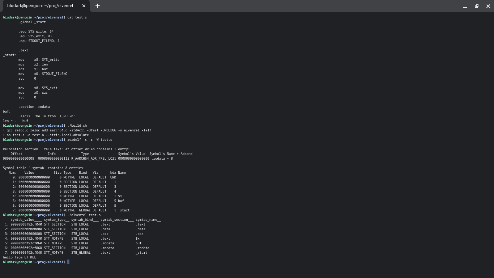

## elvenrel

Elven Relativism -- relocation and execution of ELF relocatable objects (REL)

Program loads a multitude of ELF REL files (work in progress; currently only one
REL file is loaded and processed), resolves all relocations (currently only
SHT_RELA) and if symbol `_start` in section `.text` is found, passes control to
the former.

## ToDo

* Handling of multiple REL files, with cross-REL relocations
* Resolution of all (common) relocation types
* Explicit (CLI) control over the mapping addresses of each REL (sub-page boundary?)
* Explicit (CLI) control over the process VMAs before passing control to `_start`

## Acknowledgements

Files used, with or without modifications, from external repositories:

	linux.org/ arch/arm64/include/asm/insn.h -> insn.h
	linux.org/ arch/arm64/kernel/module.c    -> reloc_add_aarch64.c

## Building

	$ ./buils.sh

## Screenshots

